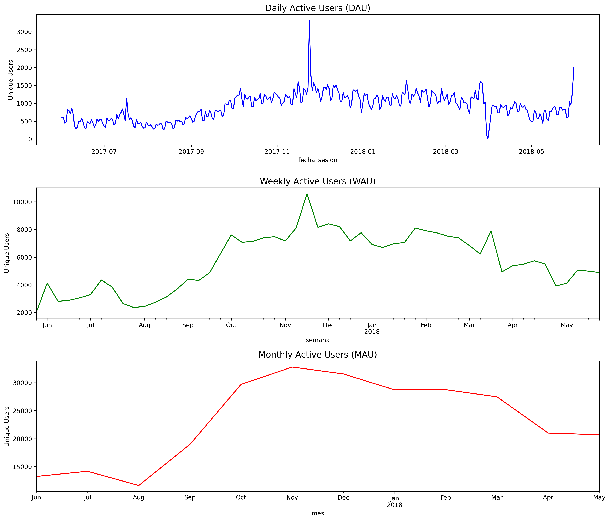
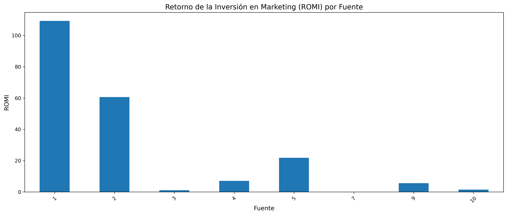
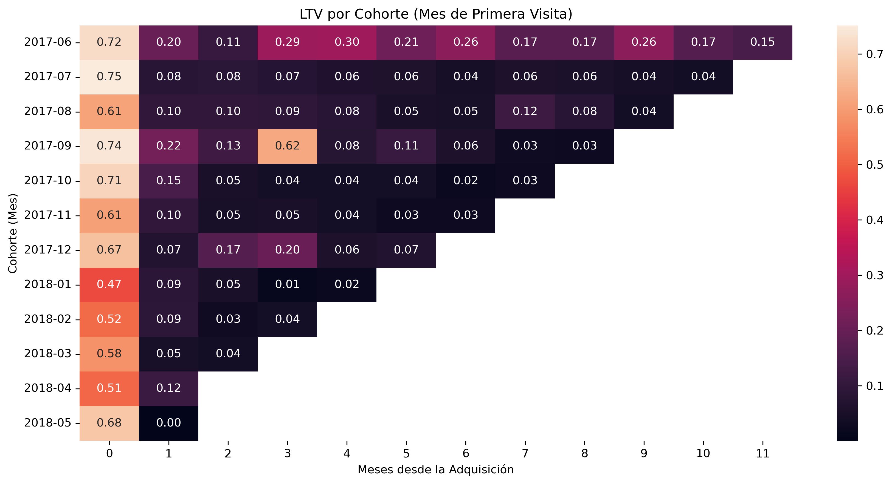

# Análisis de Marketing Digital: Resumen Ejecutivo

## Visión General

Este informe presenta un análisis completo de las estrategias de marketing digital implementadas entre junio 2017 y mayo 2018, con un enfoque en la evaluación de la efectividad de diferentes fuentes de tráfico y la optimización de la asignación presupuestaria.

## Metodología

El análisis se realizó a partir de tres conjuntos de datos principales:
- Registros de visitas al sitio web (`visits_log_us.csv`)
- Historial de órdenes de compra (`orders_log_us.csv`)
- Costos de marketing por fuente (`costs_us.csv`)

Se aplicaron técnicas de análisis de cohortes, cálculo de métricas de rendimiento (CAC, LTV, ROMI) y visualización de tendencias temporales para identificar patrones significativos.

## Hallazgos Clave

### Comportamiento de Usuarios

- **Crecimiento y estabilización**: Se observa un incremento sostenido de usuarios activos hasta finales de 2017, seguido de una estabilización
- **Usuarios activos**: Promedio diario de 908 usuarios, semanal de 5,716 y mensual de 23,228
- **Duración de sesiones**: Media de 10.7 minutos por sesión
- **Patrón de conversiones**: Más del 70% de los usuarios que realizan una compra lo hacen el mismo día de su primera visita

### Rentabilidad de Fuentes de Marketing

| Fuente | Inversión ($) | CAC ($) | ROMI | Evaluación |
|--------|---------------|---------|------|------------|
| 1 | 20,833 | 2.92 | 109.31 | **Excelente** |
| 2 | 42,806 | 5.86 | 60.63 | **Muy buena** |
| 5 | 51,757 | 5.10 | 21.83 | **Buena** |
| 4 | 61,074 | 4.28 | 7.13 | **Aceptable** |
| 9 | 5,517 | 1.98 | 5.59 | **Prometedora** |
| 10 | 5,822 | 3.28 | 1.51 | **Limitada** |
| 3 | 141,322 | 10.21 | 1.10 | **Deficiente** |

- **Asignación ineficiente**: La fuente que recibe mayor inversión (Fuente 3, 43% del presupuesto) presenta el peor rendimiento con un ROMI de apenas 1.10
- **Oportunidades desaprovechadas**: Las fuentes con mejor retorno (1 y 2) reciben solo el 19.3% del presupuesto total

### Análisis de Cohortes y LTV

- **Cohortes tempranas con mejor desempeño**: Las adquiridas entre junio-septiembre 2017 muestran un valor de por vida (LTV) significativamente superior
- **Deterioro en calidad de adquisición**: Las cohortes recientes (2018) presentan un LTV inicial más bajo y menor retención

## Recomendaciones Estratégicas

### 1. Redistribución Óptima del Presupuesto

Manteniendo el presupuesto total actual ($329,132), recomendamos una redistribución basada en la rentabilidad demostrada:

| Fuente | Presupuesto actual | Presupuesto recomendado | Variación |
|--------|-------------------|------------------------|-----------|
| 1 | $20,833 (6.3%) | $82,283 (25%) | +294.5% |
| 2 | $42,806 (13.0%) | $82,283 (25%) | +92.2% |
| 5 | $51,757 (15.7%) | $65,826 (20%) | +27.2% |
| 4 | $61,074 (18.6%) | $49,370 (15%) | -19.2% |
| 9 | $5,517 (1.7%) | $32,913 (10%) | +496.5% |
| 10 | $5,822 (1.8%) | $9,874 (3%) | +69.6% |
| 3 | $141,322 (42.9%) | $6,583 (2%) | -95.3% |

Esta redistribución podría aumentar significativamente el retorno global de la inversión en marketing.

### 2. Mejora de Retención y Valor del Cliente

- Implementar estrategias específicas para incrementar el LTV de las cohortes recientes
- Desarrollar programas de fidelización enfocados en incentivar compras recurrentes
- Crear flujos de comunicación personalizados según el comportamiento post-primera compra

### 3. Optimización por Canal

- **Fuente 9**: Explorar su potencial escalando gradualmente la inversión, aprovechando su CAC excepcionalmente bajo
- **Fuente 3**: Realizar pruebas A/B para identificar segmentos específicos donde pueda tener mejor rendimiento antes de reducir drásticamente su presupuesto
- **Fuentes 1 y 2**: Analizar qué factores contribuyen a su alto ROMI para replicar estas prácticas en otros canales

## Próximos Pasos

1. Implementar la redistribución presupuestaria de manera gradual y monitorear los resultados en tiempo real
2. Profundizar en el análisis de atribución multi-canal para comprender mejor el recorrido completo del cliente
3. Desarrollar dashboards de monitoreo continuo de las métricas clave (CAC, LTV, ROMI) por fuente
4. Realizar análisis de segmentación más detallados para identificar nichos de alta rentabilidad dentro de cada canal
